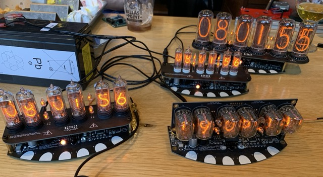
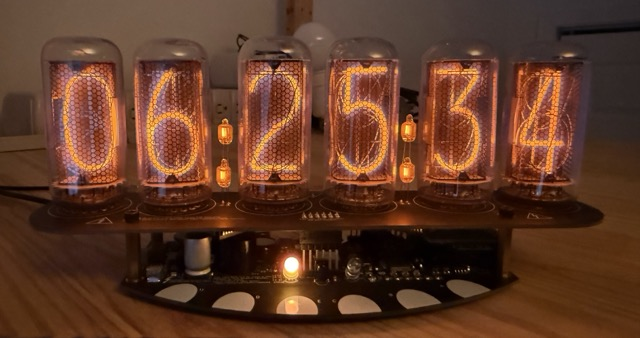

# kbx's Nixie Clock

Nixie Clock project files - PCB and source

For more pictures, see the [gallery](media/).

## Another nixie tube clock? Why?

I have to start by giving credit where credit is due. The
[Boldport Club](http://boldport.club), over the last couple of years, has
motivated me to dwell back into the world of electronics, at least as a
hobbyist. Both the kits themselves and the other members in the club are
amazing and helped inspire me to make something...so I began working on this
project. Some inspiration is taken from
[Touchy, BPC Project #7](https://www.boldport.com/products/touchy); this kit
enabled me to learn more about and actually experiment with capacitive touch.
It was clear early on that this would be a nice touch (pun intended) to add to
this project; visually, it is cleaner, it reduces the number of parts and, as a
result, it reduces the cost.

That said, the world probably doesn't need another tube clock. There are
plenty of them--all different shapes and sizes--so why build another one?

Last year, I built this lovely
[binary clock](https://github.com/kbx81/RGBBinaryClock). Some ten-plus years
ago I had built some IN-18 nixie clocks. Earlier this year (2019) one of them
became a little troublesome. I fixed it but, in the interim, became motivated
to build my own. As I already had a wonderful foundation for some clock
hardware, this seemed a natural progression. Overall I'm quite happy with the
results if I may say so myself. :)

_Sooo...another nixie clock? What's special about it?_

**Time & display**
- Shows time, date, and temperature — with a timer/counter mode, too
- 12/24-hour format and °C/°F selectable
- Smooth digit crossfades with configurable animations and effects
- Auto-dims based on ambient light — great for a bedside clock :)

**Time sources** _(all optional — mix and match)_
- GPS sync via a soldered-on LIV3F module or an
  [Adafruit GPS breakout](https://www.adafruit.com/product/746)
- External DS3234 precision RTC
- CR2032 battery or supercapacitor backup to keep time through a power outage

**Control & connectivity**
- Capacitive touch keys
- IR remote control
- [Serial remote protocol](docs/SERIAL_API.md) over UART or USB (CDC-ACM
  virtual serial port)
- Optional Wi-Fi add-on board for wireless control -- I even built an
  [ESPHome external component](https://github.com/kbx81/esphome_external_components/tree/main/components/tube_clock)
- DMX-512 via RS-485 — control each tube individually from a lighting console

**Alarms & audio**
- Up to 8 configurable alarm times with optional display blink
- Hourly binary chime — hear the time from another room!
- RTTTL melody playback
- External alarm trigger via expansion pin header

## What makes it tick?

The brain is an **STM32F072** microcontroller — capable enough on its own, but
with optional add-ons for those who want more:

- **DS3234** — high-accuracy external RTC (also has a built-in temperature sensor)
- **DS1722 / LM74** — dedicated external temperature sensors
- **LIV3F** or **[Adafruit GPS module](https://www.adafruit.com/product/746)**
  for synchronizing time from GPS

The display boards use **HV5622** high-voltage shift registers to drive the
tubes, an **RGB status LED** for at-a-glance info, and a **piezo beeper**
capable of playing RTTTL tunes. An onboard phototransistor handles ambient
light sensing for automatic brightness control.

## How do I get or build one?

In this repository you'll find everything needed to put one together. It is
divided into two major parts: hardware and software (source). The `hardware`
directory contains the [KiCad](http://kicad.org) project files used to create
the printed circuit board. The `src` directory contains the source code needed
to compile and run the application on the microcontroller. It is built on top
of [libopencm3](http://libopencm3.org). Finally, then `bin` directory contains
compiled binary files you may flash directly onto the microcontroller...great
for folks who want to solder something together but don't want to be bothered
with compiling code!

Additional details regarding the hardware and software can be found in the
`README.md` files located in each respective directory.

**That's all for now...thanks for visiting!**
