# kbx's Tube Clock — Gallery

## PCBs/Assembly

[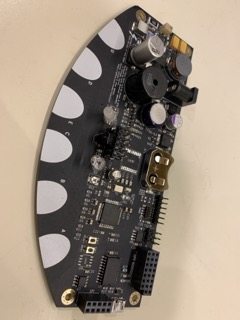](base1.jpg) [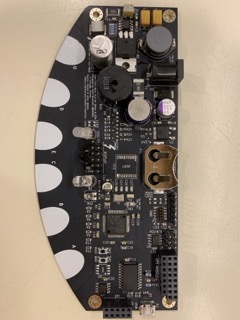](base2.jpg) [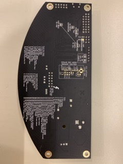](base3.jpg) [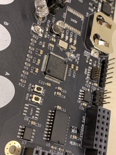](base4.jpg) [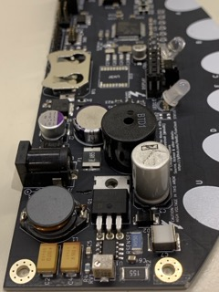](base5.jpg) [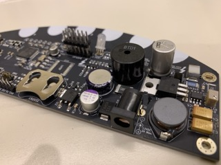](base6.jpg)

[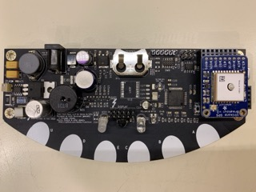](base+gps.jpg) [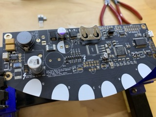](build.jpg) [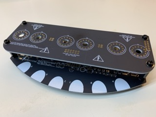](stack.jpg) [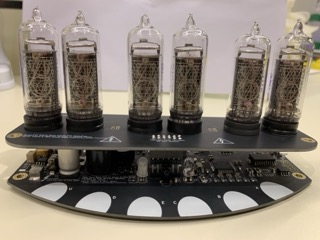](stacked.jpg) [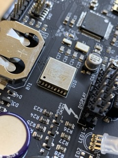](liv3f.jpg)

## PCBs

[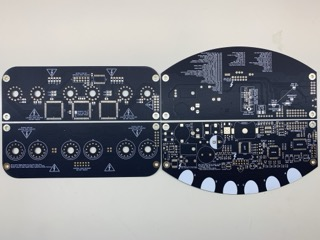](bare_pcbs.jpg) [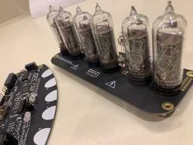](pcbs2.jpg)

## IN-12 Tubes

[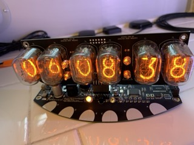](in-12_1.jpg) [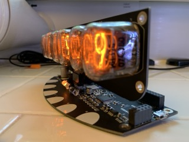](in-12_2.jpg) [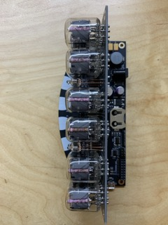](in-12_3.jpg) [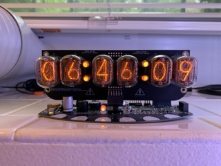](in-12_4.jpg) [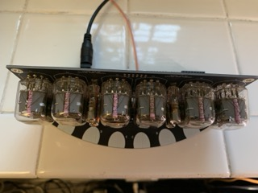](in-12_5.jpg) [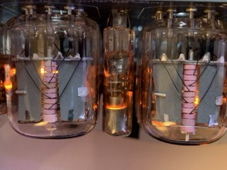](in-12_6.jpg)

## IN-14 Tubes

[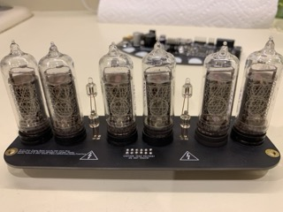](in-14.jpg) [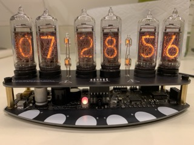](in-14_1.jpg) [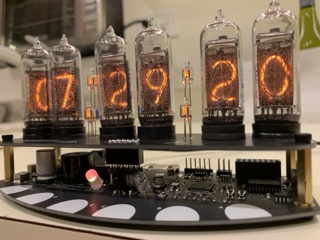](in-14_2.jpg) [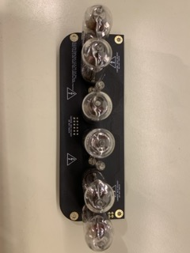](in-14_top.jpg) [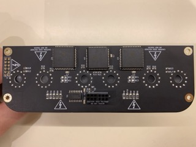](in-14_bottom.jpg) [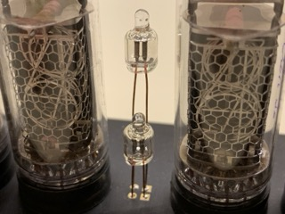](in-14_colon.jpg)

## IN-18 Tubes

[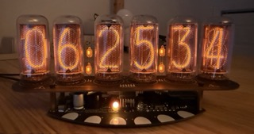](in-18.jpg) [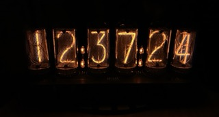](in-18_dark.jpg)

## Features

[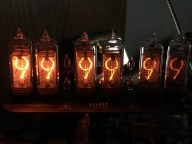](intensity.jpg)

[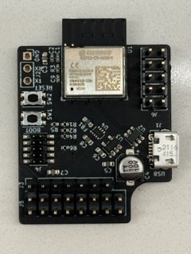](wifi_pcb_bottom.jpg) [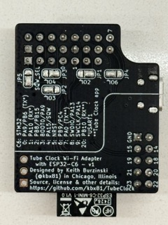](wifi_pcb_top.jpg) [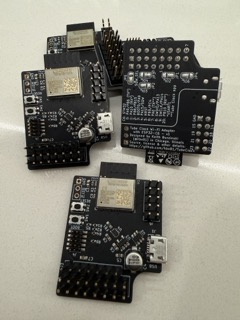](wifi_pcbs.jpg)

[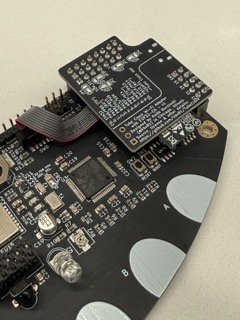](wifi_pcb_installed.jpg) [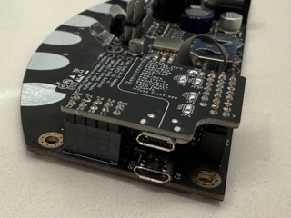](wifi_pcb_installed_2.jpg)
